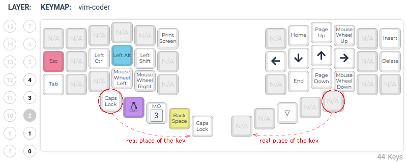

# Vim-coder (with Home-row mod) for [El Cantor HS](https://github.com/azhizhinov/qmk_firmware/tree/elcantorhs-qmk/keyboards/elcantorhs)

**0 (base)** Querty layer with [Home-row mod](https://precondition.github.io/home-row-mods) (Ctrl(s)-Alt(d)-Shift(f) -- Shift(j)-Alt(k)-Ctrl(l))
allows to dispense with control-keys from the thumb-cluster.

**1** Number layer with number keys across the home-row and shifted symbols across the top row
also uses the Home-row mod keys.

**2** Navigation layer has vim-like Arrows on hjkl and Home, End, PgUp, PgDn keys near to arrows.
The left-hand part has the control keys.

**3** Function layer with 12 Fkeys across the top row
and all control keys on the home-row.

